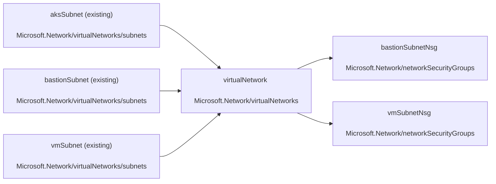

## Description

Test template

## Graph

## Parameters

| Name | Type | Description |
| -- | -- | -- |
| [`location`](./sample.bicep#L3C1-L4C49) | `string` | Specifies the location of AKS cluster. |
| [`bastionSubnetAddressPrefix`](./sample.bicep#L6C1-L7C56) | `string` | Specifies the Bastion subnet IP prefix. This prefix must be within vnet IP prefix address space. |
| [`vmSubnetName`](./sample.bicep#L9C1-L10C39) | `string` | Specifies the name of the subnet which contains the virtual machine. |
| [`vmSubnetAddressPrefix`](./sample.bicep#L12C1-L13C51) | `string` | Specifies the address prefix of the subnet which contains the virtual machine. |
| [`aksSubnetName`](./sample.bicep#L15C1-L16C41) | `string` | Specifies the name of the default subnet hosting the AKS cluster. |
| [`aksSubnetAddressPrefix`](./sample.bicep#L18C1-L19C52) | `string` | Specifies the address prefix of the subnet hosting the AKS cluster. |
| [`virtualNetworkName`](./sample.bicep#L21C1-L22C32) | `string` | Specifies the name of the virtual network. |
| [`virtualNetworkAddressPrefixes`](./sample.bicep#L24C1-L25C58) | `string` | Specifies the address prefixes of the virtual network. |

## Outputs

| Name | Type | Description |
| -- | -- | -- |
| [`virtualNetworkResourceId`](./sample.bicep#L242C1-L243C59) | `string` | The virtual network resource id. |
| [`bastionSubnetId`](./sample.bicep#L245C1-L246C49) | `string` | The bastion subnet resource id. |
| [`aksSubnetId`](./sample.bicep#L248C1-L249C41) | `string` | The AKS cluster subnet resource id. |
| [`vmSubnetId`](./sample.bicep#L251C1-L252C39) | `string` | The virtual machine subnet resource id. |

